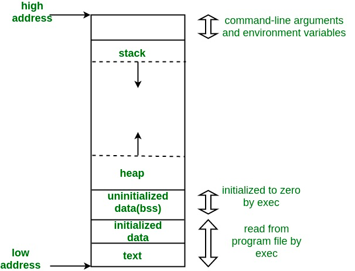
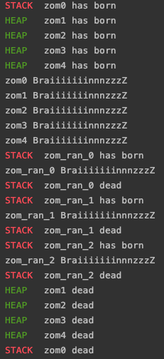
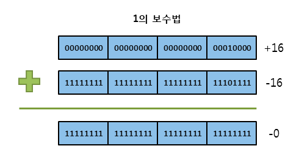
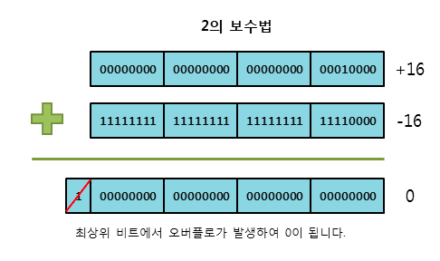

# CPP MODULE 01

## Exercise 00: BraiiiiiiinnnzzzZ

#### About Memory


메모리 레이아웃은 다음과 같이 이루어진다.
* text segment
    * 보통 코드 영역이라 부르는 장소. 실행에 대한 명령을 담고있다.
* initalized data segment
    * 전역변수, 정적변수 중 초기화 된 데이터들이 담긴다. 세부적으로는 READ only , READ / WRITE 영역이 나누어진다.
* uninitalized data segment (bss : block start by symbol)
    * 전역변수, 정적변수 중 초기화되지 않은 데이터들이 담긴다.
* heap
  * 동적 메모리 할당이 발생하는 영역. brk/sbrk 와 같이 데이터 세그먼트의 영역을 늘리는 시스템콜을 사용하는 malloc, realloc 및 free에 의해 관리된다.
* stack
    * 함수가 호출될 때마다 돌아갈 곳의 주소, 레지스터와 같은 호출자의 대한 정보, 임시 변수 등이 저장되는 영역.
    * 한 함수에 대한 정보의 단위를 Stack frame 이라 지칭함.

#### subject는 무엇을 요구하는가
```c++
Zombie *newZombie(std::string name)
	return new Zombie(name);
```
`newZombie()` 함수는 Zombie 클래스 인스턴스를 new 를 사용해 동적 할당하고, 포인터를 반환함.
`newZombie()` 함수는 포인터를 반환하고 STACK 에서 제거됨.
하지만 반환한 Zombie 인스턴스는 HEAP 영역에 남아있고, 다른 함수에서 이를 사용 가능함.

-> Heap memory case

```c++
void randomChump(std::string name)
{
	Zombie temp_zombie = Zombie(name);
	temp_zombie.announce();
	return;
}
```
`randomChump` 함수는 호출시 지역변수(`temp_zombie`)에 Zombie 클래스 인스턴스를 초기화 한다.
`newZombie()` 함수는 Zombie 의 `announce()` 메서드를 실행한 뒤 STACK 에서 제거됨.
`temp_zombie` 는 `newZombie()` 함수가 제거될 때 같이 소멸한다.

-> Stack memory case

##### 어떻게 검증하는가

이론적으로 이해한 내용을 바탕으로 코드를 구현했지만, 실제로도 이론과 같이 작동하는지 확인해보고 싶기에 다음과 같은 방법을 사용하였다.

1. STACK/HEAP 외의 주소값 찾기
```c++
#include <mach-o/getsect.h> 
// mac os에서 .bss .text .data 등의 주소값을 가져올 수 있도록 도와주는 라이브러리 

bool IS_IN_STATIC(void *x){
	unsigned long end = get_end();
	if (x <= (void *)end)
		return TRUE;
	return FALSE;
}
```

`get_end()` 는 bss 가 끝나는 주소값을 반환한다. 비교하고자 하는 대상을 인자로 받아 end 값과 비교하여 HEAP/STACK 영역 외에 존재하는지 확인할 수 있다.

2. Stack 주소값 찾기
```c++
void *stack_bottom;

bool IS_IN_STACK(void *x) __attribute__((noinline));
bool IS_IN_STACK(void *x) {
	void *stack_top = &stack_top;
	return x <= stack_bottom && x >= stack_top;
}

int main(){
	int bottom;
	stack_bottom = &bottom;
	...
}
```

Stack 영역에 해당하는지 판별하기 위해선 Stack의 시작점과 끝점을 확인하면 된다. 

먼저 Stack 의 시작점을 찾아보자. main 역시 함수이기에 Stack에 올라가고, 프로그램 인자로 들어온 값(argv), 환경변수 등이 stack의 시작점에 위치하게 된다.

예시에서는 편의를 위해 전역변수 하나를 두고 Main 의 시작과 함께 임시변수 하나의 값을 가르키도록 했다.

Stack 의 끝점은 먼저 비교를 함수를 만들면 된다. 비교를 위해 `IS_IN_STACK()` 함수를 호출하게 되면, stack 의 최상부에 해당함수가 올라가고, 이때 생긴 임시변수의 주소값을 통해 stack의 끝점을 확인할 수 있다.

`IS_IN_STACK()` 호출 된 동안 우리는 Stack 의 시작점과 끝점을 알 수 있다. 이제 우리는 비교하고자 하는 대상의 주소값을 비교해보면 Stack 영역에 해당하는지 아닌지 확인이 가능하다.  

`IS_IN_STACK()` 의 경우 `noinline` 을 사용하였는데, 이는 컴파일러가 최적화를 위해 해당 함수를 다른 함수에 포함 시키는 것을 막기 위해서다. 

3. Heap 주소값 찾기

Heap 경우 정확히 어디서부터 어디까지인지 찾기는 어렵다. 

하지만, 우리는 1. 2.를 통해 비교하고자 하는 대상이 Stack 에 속하는지 또는 STACK/HEAP 외의 영역에 속하는지 알수있다. 

만약 둘다 속하지 않는다면 Heap 영역에 속한다는 것을 간접적으로 알 수 있다.


4. Class instance 의 고향 찾기
```c++
Zombie::Zombie(std::string name)
	Say_Your_Origin((void *)this);

Zombie::~Zombie(void)
	Say_Your_Origin((void *)this);
```
위 1. 2. 3. 을 통해 우리는 메모리 주소값이 있다면 어떤 메모리 영역에 속하는지 알 수 있게됐다.

이제 적절한 메모리 위치를 판별하는 함수와 함께, 소속된 메모리 영역을 출력하는 `Say_Your_Origin()` 함수를 생성자와 소멸자에 포함시키고 다음 메인문을 실행시켜보자.
```c++
int main(){
	Zombie zombie0 = Zombie("zom0");
	Zombie *zombie1 = new Zombie("zom1");
	Zombie *zombie2 = new Zombie("zom2");
	Zombie *zombie3 = newZombie("zom3");
	Zombie *zombie4 = newZombie("zom4");

	zombie0.announce();
	zombie1->announce();
	zombie2->announce();
	zombie3->announce();
	zombie4->announce();

	randomChump("zom_ran_0");
	randomChump("zom_ran_1");
	randomChump("zom_ran_2");

	delete zombie1;
	delete zombie2;
	delete zombie3;
	delete zombie4;

	return (0);
```



## Exercise 05: Karen 2.0

#### About Branch(Jump) Table

> A jump table can be either an array of pointers to functions or an array of machine code jump instructions

만일 정해진(static) 함수의 집합이 있다면 함수의 pointer 를 Table 로 만들 수 있다.
이 Table 의 index 를 통해 간단히 함수 포인터를 검색하거나 접근할 수 있다!

이를 사용할 시 이점은
* index는 메모리 효율이 좋다(if/else 는 메모리 효율이 나쁜편).
* 외부 함수에서 사용해도, index는 stable 하다는 점.
* 함수를 변경하고자 하면 포인터만 교체하면 됨.

```c++
inline char prompt() //this function will probably 900% be inlined even if you don't specify the inlike keyword
{
    printf("Enter bits from 0 to 3 or q to quit:\n");
    char v;
    while (!(std::cin >> v)); //Just to make sure we get valid input
    return v;
}

int main()
{
    static const std::unordered_map<char, void(*)()> mymap = 
    {
        { '0' , Zero },
        { '1' , One },
        { '2' , Two },
        { '3' , Three }
    };

    while(1)
    {
        auto it = mymap.find(prompt());

        // Without this check, your program will crash if input is invalid.
        if (it != mymap.end()) 
        {
            it->second();
            break;
        }
    }

    return 0;
}
```

# CPP MODULE 02

## Exercise 00: My First Orthodox

#### About Complement

* 음수의 표현
  * 부호 비트와 절대값
    * 최상위 bit로 부효를 표현하고, 나머지 비트로 정수의 절대값을 표현
    * 표현할 수 있는 절대값의 범위가 절반이 됨.
    * -0 이 존재하는 문제점이 생김.
  * 1의 보수법(One's Complement)
    * not 연산으로 양수의 모든 비트를 반전해서 음수를 표현하는 방법.
    * -0 이 존재하는 문제점이 생김.
      
  * 2의 보수법(Two's Complement)
    * not 연산 후 1을 더해서 음수를 표현하는 방법.
    * 0 의 경우 not 연산 후 1을 더하면 overflow 로 인해 다시 0이 됨
    * -0 을 없앨 수 있다!
      
  * 바이어스 표현법(Biased notation)
    * float point 의 지수부 부호를 표기하기 위해 사용
    * 가장 작은 음수를 00....00, 가장 큰 양수를 11....11 과 같이 표현하는 방법.
    * 부호를 바꾸기 위해선 정해진 상수를 더하거나 빼야 함(IEEE754 표준 8bit 기준 2^(8-1)-1).
#### About Fixed/Float Point Number

* fixed point bits (고정 소수점)
  * 고정 소수점은 특정한 크기로 예약된 bit 의 정수부와 소수부를 갖는다.


* float point bits (부동 소수점)
  * 부동 소수점은 부호부 1bit 지수부 8bit 가수부 23bit 를 갖는다.
  * 표현하고자 하는 수를 2진수로 치환하고, `1.가수부 * 2^지수부` 와 같은 형태로 만든다.
  * 가수부는 가수부에 2를 계속 곱하여 정수로 만든 뒤 2진법으로 변환한다고 생각하면 쉽다.
  ```c++
  10진수를 2진수로
  0.6875 * 2 = 1.375
  1.375 * 2 = 2.75
  2.75 * 2 = 5.5
  5.5 * 2 = 11
  11 ---binary--> 1011
  == 0.1011
  
  2진수를 10진수로
  0.1101
  1 / 2^1 + 1 / 2^2 + 0 / 2^3 + 1 / 2^4
  
  * ```
  * 정수부는 무조건 1이기 떄문에 이는 데이터에서 생략됨.

